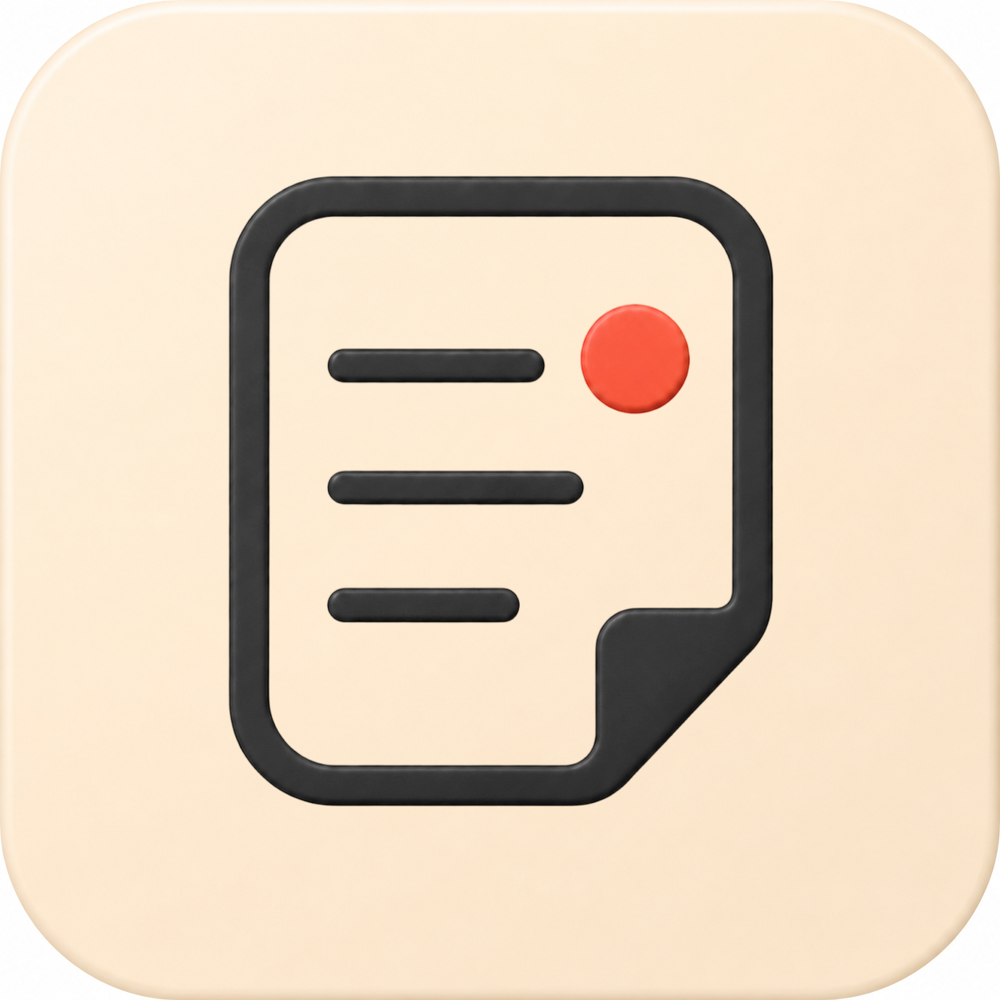
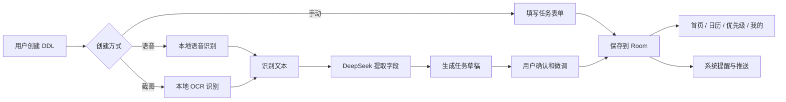
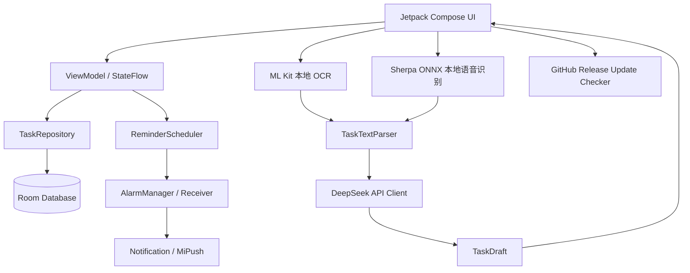
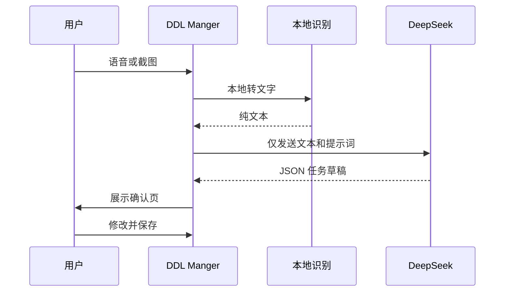
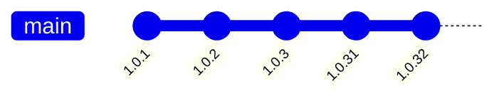

# DDL Manger

> 面向学生、课程、项目和比赛场景的 Android Deadline 管理应用。  
> 手动添加永远可用；语音和截图识别在用户配置 DeepSeek API 后启用，并且所有智能解析结果都必须由用户确认后才会保存。

<p align="center">
  
</p>

<p align="center">
  <a href="https://github.com/Soupcpu/DDL_Mate/releases/latest">
    
  </a>
  
  
  
</p>

## 当前版本

| 项目 | 内容 |
| --- | --- |
| 应用名称 | DDL Manger |
| 当前版本 | `1.0.32` |
| 包名 | `com.deadlinemate` |
| 最低系统 | Android 8.0 / API 26 |
| 技术栈 | Kotlin, Jetpack Compose, Room, ML Kit OCR, Sherpa ONNX ASR, DeepSeek API |
| 发布形式 | GitHub Releases debug APK 测试发布 |

## Star 趋势

> 如果图片没有立即显示，GitHub 会在仓库有 Star 数据后自动生成趋势图。

[](https://starchart.cc/Soupcpu/DDL_Mate)

## 核心能力

| 功能模块 | 状态 | 说明 |
| --- | --- | --- |
| 手动添加 DDL | 已完成 | 无需网络，基础功能始终可用 |
| 本地语音识别 | 已完成 | 使用本地语音模型转文字，不上传原始音频 |
| 截图 OCR | 已完成 | 支持多张截图批量选择，本地提取文字 |
| DeepSeek 智能解析 | 已完成 | 仅上传识别后的文本，返回任务草稿 |
| 多图多任务确认 | 已完成 | 多张截图并发解析，以卡片切换确认 |
| 日历视图 | 已完成 | 支持周历/月历与任务按日期切换 |
| 优先级视图 | 已完成 | 按真实 DDL 数据展示任务优先级 |
| 提醒通知 | 已完成 | 支持系统提醒、测试提醒与小米推送适配 |
| 个人统计 | 已完成 | 本周完成度、连续完成 DDL、已完成列表 |
| 应用内更新 | 已完成 | 对接 GitHub Releases，可后台下载并显示进度 |

## 产品流程



## 架构概览



## DeepSeek 隐私边界



应用不会把原始音频或原始截图上传给 DeepSeek。DeepSeek 只负责从文本里提取任务名称、开始时间、截止时间、重要性、提醒、重复规则、任务类型和备注。

## 1.0.32 更新

- 优化多张截图识别：OCR 与 DeepSeek 解析改为并发处理。
- 修复多张截图标题相似时标题前缀丢失的问题，例如 `计算机科学实验报告2` 不会被缩成 `实验报告2`。
- 多图任务确认页改为更紧凑的布局，减少确认时的上下滑动。
- README 升级为 GitHub 展示版，增加图标、徽章、Star 趋势图、功能矩阵和架构图。

## 安装测试版

1. 打开 [GitHub Releases](https://github.com/Soupcpu/DDL_Mate/releases/latest)。
2. 下载最新的 debug APK。
3. 在 Android 手机上安装并允许必要权限。
4. 首次使用语音或截图识别前，在「我的」页面配置 DeepSeek API。

## 本地构建

```powershell
.\gradlew.bat :app:assembleDebug
```

构建产物通常位于：

```text
app/build/outputs/apk/debug/
```

如果 Android Studio 提示缺少 SDK，请安装 `compileSdk 35` 对应平台，并在 `local.properties` 中配置本机 SDK 路径。

## 项目结构

```text
deadline/
├─ app/                 Android 应用源码
├─ design/              原型和需求说明
├─ icon/                应用图标资源
├─ issue/               审查记录和测试文档
├─ MiSDK/               小米推送 SDK 参考文件
├─ build.gradle         根 Gradle 配置
└─ README.md            GitHub 展示文档
```

## 发布策略



当前阶段以 GitHub Releases 分发测试 APK。后续可以继续补充签名 release 包、更新通道、崩溃收集、自动化测试和正式发布说明。
